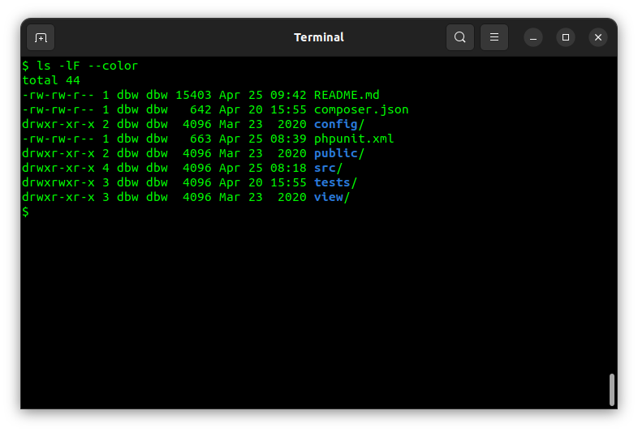
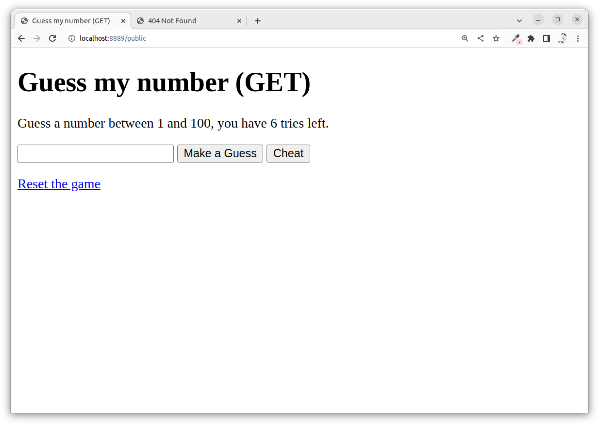
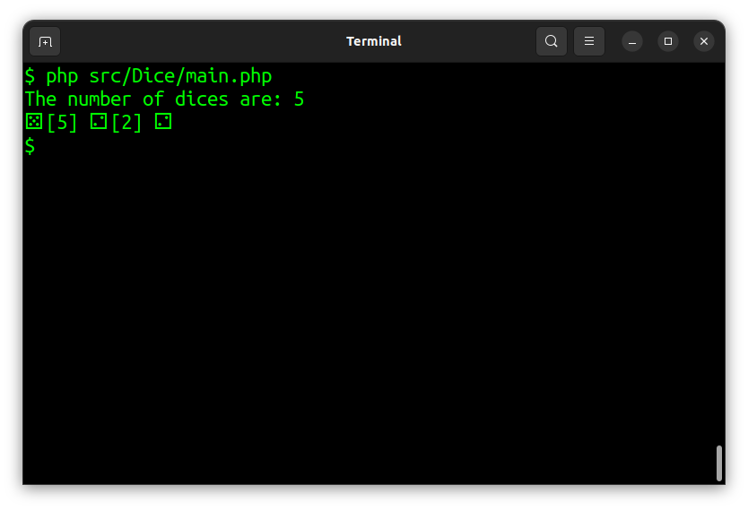
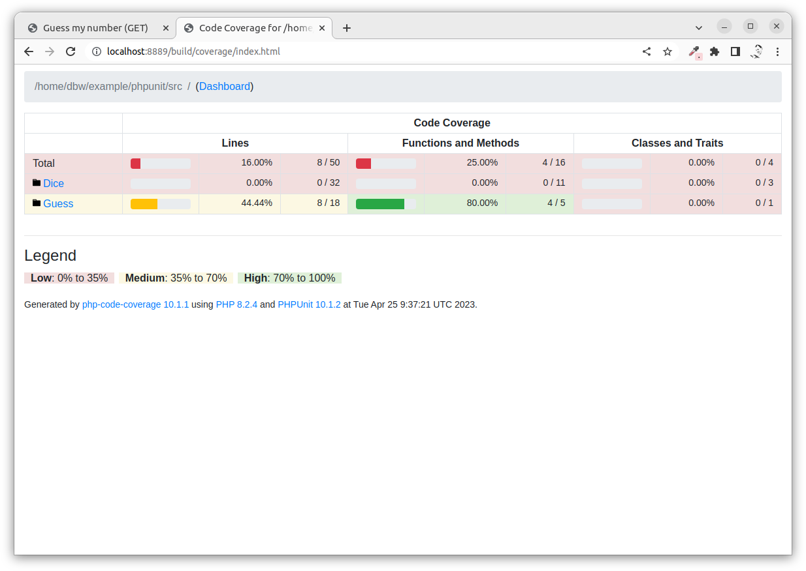
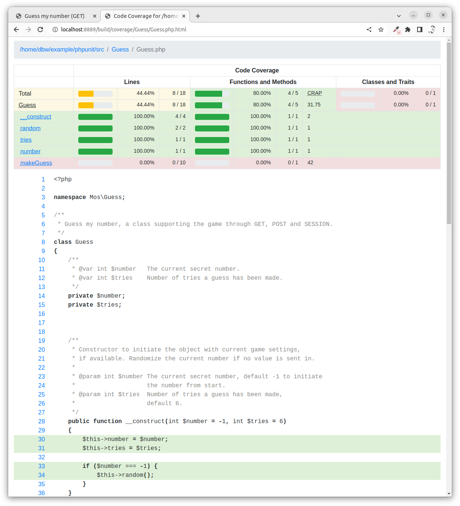
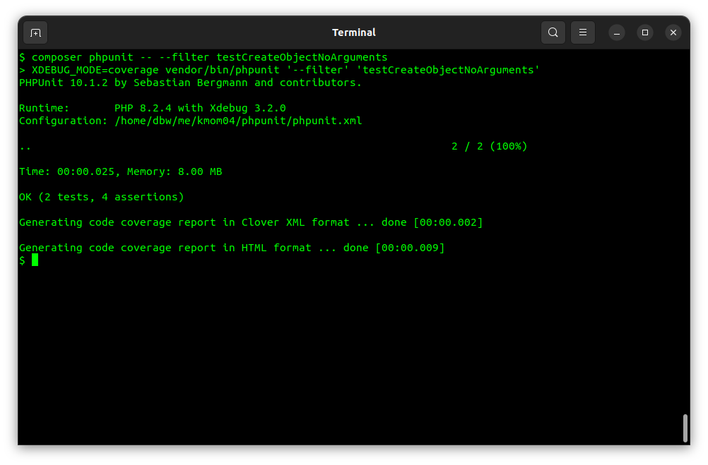
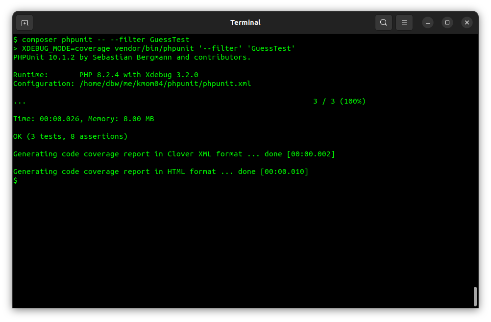
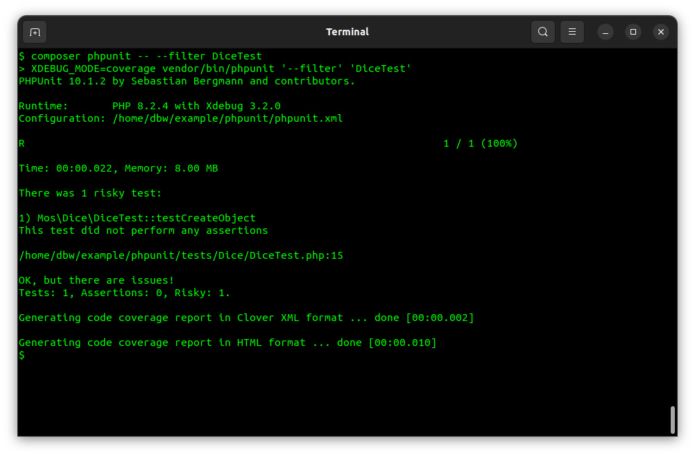

<!--
---
author: mos
revision:
    "2024-04-23": "(D, mos) Reviewed and upgraded to PHP 82 and PHPUnit 11."
    "2023-04-25": "(C, mos) Reworked."
    "2023-04-20": "(B, mos) Reviewed."
    "2022-03-27": "(A, mos) First release."
---

-->


Get going with phpunit
===================================

This article and exercise help you to get going with unit testing and phpunit for PHP. You will see how code coverage can be visualized as an aid in reaching a complete test suite for the source code.

Start by walking through the article and verifying that the examples work as explained. At the end of the article are some exercises that you can practice on your own.

<!--
TODO

* Add slideshow explaining the details on phpunit, as an intro to the exercise
* Improve, or is it already too large?
    * Perhaps add another exercise that is optional that covers more advanced topics?

* Test class doing print (mock or rewrite)
* Setup and teardown
* Test with arrays of values
* Make tests depend on each other

-->


<!--
Recording
-----------------------------------

There is a recording from a Zoom session where Mikael walks you through this exercise.

[](http://www.youtube.com/watch?v=T0dLCpoBvs4 "Kurs mvc kmom04 tisdagsgenomgång, övning phpunit")
-->


Prerequisite
-----------------------------------

You have PHP 8.2 or above (supported by PHPUnit 11) and can execute `php` in the terminal.

For other versions of PHP you might want to check out [the list of supported versions for PHPUnit](https://phpunit.de/supported-versions.html).

You have composer installed.

You have installed and enabled the PHP Xdebug extension for PHP CLI.


The example code
-----------------------------------

This is the directory structure for the example program and some of the more important parts.

| Item            | Description     |
| :-------------- | :-------------- |
| `composer.json` | To use the autoloader from composer. |
| `config/`       | Directory for configuration files. |
| `phpunit.xml`   | Configuration read by phpunit on startup. |
| `public/`       | A web application implementing a game. |
| `src/`          | The source code classes to test. |
| `tests/`        | The test suite with all test cases that phpunit will execute. |
| `view/`         | Template files (views) fot the web application. |



Check out the directory structure and the content of the files to get acquainted with them.


Copy files to a working dir
-----------------------------------

You should copy the example files to a working dir so you are free to modify the files.

```
# Go to the root of the repo
rsync -av example/phpunit/ me/kmom04/phpunit/

cd me/kmom04/phpunit/
```


Before we start
-----------------------------------

We need to install the dependencies to the application and install the modules needed for the unit tests. Composer solves that for us.

```
composer install
```

This will set up the autoloader in composer so that all source files can be found.

You can inspect the `composer.json` how it setup the autoloader and how it includes phpunit.

You can always restart and begin from the beginning.

```
composer clean-all
composer install
```

Before we proceed, check that you can execute the phpunit command, it is installed in the `vendor/bin` directory.

```
$ vendor/bin/phpunit --version
PHPUnit 11.1.2 by Sebastian Bergmann and contributors.
```

Your version of phpunit might look different than mine, but it is okay.


Check the applications
-----------------------------------

The example contains two applications, one web application and one terminal application. This is the source code we want to test. You can try the applications like this.


### The web application

The web application you open in the web browser by pointing to `public/` through your local web server or by starting the PHP built-in web server.

```
php -S localhost:8889
```

It can look like this.



The source code for this example is mainly a class [`Guess`](src/Guess/Guess.php) implementing the game "Guess my number" where it holds a number between 1 and 100 and the guesser should guess the number where each guess results in a reply of "Correct", "Too high" or "Too low".

An exception is thrown when your guess is higher than 100 or lower than 1.

The game controller is in the file [`htdocs/index.php`](htdocs/index.php).

The game is rendered by the view in [`view/guess`](view/guess).

The basic configuration is set up in [`config/config.php`](config/config.php), mostly dealing with error handling and a default exception handler that takes care of all exceptions not caught by the programmer.


### The terminal application

The terminal application can be executed from the file [`src/Dice/main.php`](src/Dice/main.php) like this.

```
php src/Dice/main.php
```

The output can look like this.

```
The number of dices are: 5
⚁ [6] ⚃ [3] ⚂ 
```

This is how it looks in the terminal.



The terminal application is more trivial than the web application and just rolls a hand with some dice and shows the results.


Executing the test cases
-----------------------------------

The test suite consists of the test cases in the directory `tests/` and its subdirectories.

There is a bootstrap file in `tests/config.php` that includes the autoloader. This file can also be used to add further configuration and connections to the source application.

The directory `tests/` have the same structure as the `src/` directory, so you should find that the two structures map to each other. It should then be rather easy to find the test class for a specific source class.

All classes ending with postfix `Test` will be executed by phpunit. Start by organizing your tests so that each source class has at least one test class.

You can execute the test suite, with all test cases, directly through the phpunit executable or through the Composer script.

```text
# phpunit directly 
XDEBUG_MODE=coverage vendor/bin/phpunit

# Composer script
composer phpunit
```

The output can look like this.

```text
PHPUnit 11.1.2 by Sebastian Bergmann and contributors.

Runtime:       PHP 8.2.4 with Xdebug 3.2.0
Configuration: /home/dbw/me/kmom04/phpunit/phpunit.xml

......                                                              6 / 6 (100%)

Time: 00:00.049, Memory: 12.00 MB

OK (6 tests, 16 assertions)

Generating code coverage report in Clover XML format ... done [00:00.017]

Generating code coverage report in HTML format ... done [00:00.010]
```

The output states that all three test cases were carried out, containing a total of 8 assertions. It also states that the code coverage was generated in both a clover and a HTML report.

This is how it could look like when executing the test suite through composer.


Now, let's use the code coverage to see how much of the code is covered by the current test suite.


Review the code coverage
-----------------------------------

Let's look at the code coverage report that is generated. It is a report saved in the generated directory `build/coverage` that provides a HTML view of the classes, methods and lines of code tested.

Open a web browser to `build/coverage/index.html` and review the report.

First, there is an overview of all source classes.



Then we can see the overview of a part of the source code.


We can also see the details for each line and method in a selected class.



As a general rule of thumb, try to get the report to show the color green. It is nice to have 100% code coverage, but sometimes it is just fine with 70%. The percentage of code coverage is not the single most important metric of how good your test suite is.


Files related to the tests
-----------------------------------

Let's look at the files related to phpunit and the test suite.

| Item               | Description     |
| :----------------- | :-------------- |
| `build/coverage`   | The report with the code coverage from the test suite. |
| `phpunit.xml`      | Configuration read by phpunit on startup. |
| `tests/<srcdir>`   | The test suite with all test cases that phpunit will execute. |
| `tests/config.php` | Bootstrap file to setup PHP essentials for phpunit and the surroundings, including the autoloader and defining constanst or including mocks. |

You should have a quick look at the [`phpunit.xml`](phpunit.xml) file, you can there find how it points out the tests directory and the bootstrap file.


Review a test case
-----------------------------------

Here follows a basic setup for a test class. It is a class with any namespace and its name ending with the postfix `Test`. It should extend the class `\PHPUnit\Framework\TestCase`. 

Here is the setup for the test class [`tests/Guess/GuessTest.php`](tests/Guess/GuessTest.php) that adds unit tests for the source class [`src/Guess/Guess.php`](src/Guess/Guess.php).

```php
namespace Mos\Guess;

use PHPUnit\Framework\TestCase;

/**
 * Test cases for class Guess.
 */
class GuessTest extends TestCase
{

}
```

Add a test to the class by adding a method and name it prefixed by `test`. All such methods will be executed by the test runner (phpunit).

Here is a test method that creates an instance of the game and performs the assertion that it has 6 guesses available.

```php
/**
 * Construct object without arguments and verify there is 6 tries left.
 */
public function testCreateObjectNoArguments()
{
    $guess = new Guess();
    $this->assertInstanceOf("\Mos\Guess\Guess", $guess);

    $res = $guess->tries();
    $exp = 6;
    $this->assertEquals($exp, $res);
}
```

A test method is considered as one test or one test case. It can carry out zero or several assertions that verify that certain conditions are fulfilled. The various methods for assertions are provided by phpunit through the base class.


Execute a single test case
-----------------------------------

When the test suite grows, it can be useful to execute only one test class or one specific test method.

This is how to execute only one specific test method.

```
composer phpunit -- --filter testCreateObjectNoArguments 
```



Note the first `--` that says to composer to add the remaining part as arguments to the command. The `--filter` is a way to ask phpunit to only run the tests matching that string.

Another way to use `--filter` is to only execute the tests from a specific class, for example `--filter GuessTest`. Try it like this.

```
composer phpunit -- --filter GuessTest 
```



This is quite convenient when you are troubleshooting your unit tests.


More on unit tests
-----------------------------------

Unit testing is white box testing. Unit tests should always have assertions and they should be runnable independently from each other.

You should aim to get high coverage.


### White box testing

The class which is the test object is considered to be a white box test object. The class code is readable to the one who writes the test suite.

The main approach is to write test cases for the public methods of the class. It would require other test strategies to test a class having protected members not accessible from the class public API or testing a class having external dependencies or testing a class using persistent storage like a database. Those are more advanced test cases and require a bit more reading in the phpunit manual.


### A unit test has at least one assertion

Your test suite shall execute as many class methods as possible and verify various states of the tested class using assertions.

Someone has said the following.

> _"If it have no assert, it aint no test."_

Assertions are ways to check that various states and values are correct after some code is executed. A test contains code executing public methods in the class and performing asserts on post conditions, types and return values.


### A unit test should be runnable independently from other tests

Another important thing to remember is that each test should be able to run independently from the other tests. This will make it possible to execute tests independently of each other and even in parallel to speed things up.

> _"If the tests can not run independently, then they are not unit tests."_

Feel free to add several test classes for a single source class. It might be easier to navigate all your tests when the test classes have fewer lines of code.


### Get good code coverage

Try to cover as many source lines of code as possible with your test suite. The test cases you write should cover the whole code, each class, each method, and each line, at least once. Some code sections need to be covered by several test cases due to their complexity depending on different values or states.

In most cases, one should be able to get code coverage through the class public API with the public methods. That would imply a class that is written to be testable. If you have code sections that can not be reached through the public API, then you should ask yourself "why do I have this structure?". 

Sometimes you encounter classes that are hard to write test cases for or to get enough code coverage. This can be an indicator to refactor the class to make it more testable.


### Structure your tests

Divide your test suite into classes having reasonable sizes. That will make it easier to maintain and further develop your test suite.

Use many small test methods, testing specific areas. Name these methods with proper names, describing what they test. This will aid when trying to remember what a certain method is testing. Write a one-liner comment above each method to further explain what the test does, which will also aid in maintaining and developing your test suite.


Add unit tests Dice
-----------------------------------

To practice we can add a test class `TestDice.php` for the source class `Dice`.


### Add a test class DiceTest

We start adding the class in the file `tests/Dice/DiceTest.php`.

```php
<?php

namespace Mos\Dice;

use PHPUnit\Framework\TestCase;

/**
 * Test cases for class Dice.
 */
class DiceTest extends TestCase
{

}
```

Execute the test class to view that it works but no tests are executed.

```
composer phpunit -- --filter DiceTest
```


### Add a test method for Dice

We add a test method, a test case, where we instantiate a dice object from the class.

```php    
    /**
     * Construct object.
     */
    public function testCreateObject()
    {
        $die = new Dice();
    }
```

Run the tests.

```
composer phpunit -- --filter DiceTest
```



A risky test can be a test that has no assertion. We can add an assertion that the instance object is of a certain class.

```php
    /**
     * Construct object and verify it it a Dice object.
     */
    public function testCreateObject()
    {
        $die = new Dice();
        $this->assertInstanceOf("\Mos\Dice\Dice", $die);
    }
```


Is there something else we can assert with an empty object like this? Well, we can assert what the initial dice value is. looking at the source code we can see that the value is `null` when the dice is not rolled.

We update the test method like this.

```php
    /**
     * Construct object and verify it it a Dice object.
     */
    public function testCreateObject()
    {
        $die = new Dice();
        $this->assertInstanceOf("\Mos\Dice\Dice", $die);

        $res = $die->getValue();
        $exp = null;
        $this->assertEquals($exp, $res);
    }
```

There is an assertion for `$this->assertNull()` which might improve the code above.

We now have a test suite with one test case and two assertions.

Review how the code coverage has changed.


### Test while rolling the dice

Now consider how we can test the dice being rolled. You need to create an instance of the dice, roll it and then do some assertions. 

But what can you assert?

Here follows an example that you can try and evaluate.

```php
    /**
     * Roll the dice and assert value is within bounds.
     */
    public function testRollDice()
    {
        $die = new Dice();
        $res = $die->roll();
        $this->assertIsInt($res);

        $res = $die->getValue();
        $this->assertTrue($res >= 1);
        $this->assertTrue($res <= 6);
    }
```

Is this a good test or not? Can it be improved?

Your test suite now has two tests and five assertions.

Verify what coverage you have on the class. Can you find an easy path to enhance the coverage?


Reach 100% coverage in Guess
-----------------------------------

As an exercise, you can finalize the test suite for the Guess class by adding test case(s) with assertions for the method `Guess::makeGuess()` and do reach a code coverage of 100%.

Do also try to incorporate the class `GuessException` into your unit tests.

This is how you can verify that some code throws an exception.

```php
    /**
     * Verify GuessException when guess is to high.
     */
    public function testGuessToHigh()
    {
        $guess = new Guess();

        $this->expectException(GuessException::class);
        $guess->makeGuess(101);
    }
```

Work with the code coverage report to verify how close to 100% you can reach.


Summary
-----------------------------------

You have now verified that phpunit and code coverage works in your environment and you have had an opportunity to gain some understanding of how unit testing and phpunit work.

A good way to proceed is to create unit tests for your application code.


References
-----------------------------------

You can read more on PHPUnit on their website and in the documentation.

* [PHPUnit home page](https://phpunit.de/)
* [The Manual](https://phpunit.readthedocs.io)
* [PHPUnit and PHP supported version](https://phpunit.de/supported-versions.html)
* [PHPUnit on GitHub](https://github.com/sebastianbergmann/phpunit)

To enable code coverage you need to install Xdebug.

* [Home page for Xdebug](https://xdebug.org/)


<!--
Thoughts
-----------------------------------

What about the PHP code in the directories `config/`, `htdocs/` and `view/`? Should that code also the covered by unit test or not?

Testable code is said to be good and clean code. Consider refactoring your code when it is not testable.
-->
